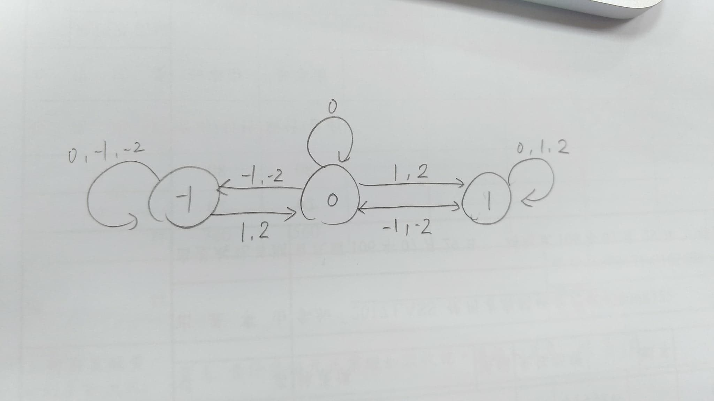

# HW1-AutoTrading

  - A program that can decide to buy or sell the stock automatically for the future trend predicted by the model, learned by training_data.csv
  - Output: a sequence of actions(1 means to buy, 0 means to hold, and -1 means to sell the stock) for eachday
  - The target is to get more profit

## Ideas
### Training:
Because the action decided by the model will execute on the next day's open price, the concept of my model is based on 2 classes:
* the change rate of open price
* previous open prices

Besides, the raw data of the stock is too undulating to train a suitable model for the testing data, so we will preprocess the data by caculating moving average(MA) of 10 day's data.
We choose AdaBoost, which is kind of classfier, to predict tomorrow's trend. The features of AdaBoost contains 5 items:

And the change rate(slope), which is use to predict the trend:

The label shows the trend of tomorrow's MA to predict, and it has 5 classes, the boundary of these classes is specified in the trader.py:
* -2 means drop significantly
* -1 means drop slightly
* 0 means stable
* 1 means grow slightly
* 2 means grow significantly

### Actions:
Based on current state and the predicted label

### Usages:
python trader.py --training "Your Training Data" --testing "Your Testing Data" --output "Your Output File"
